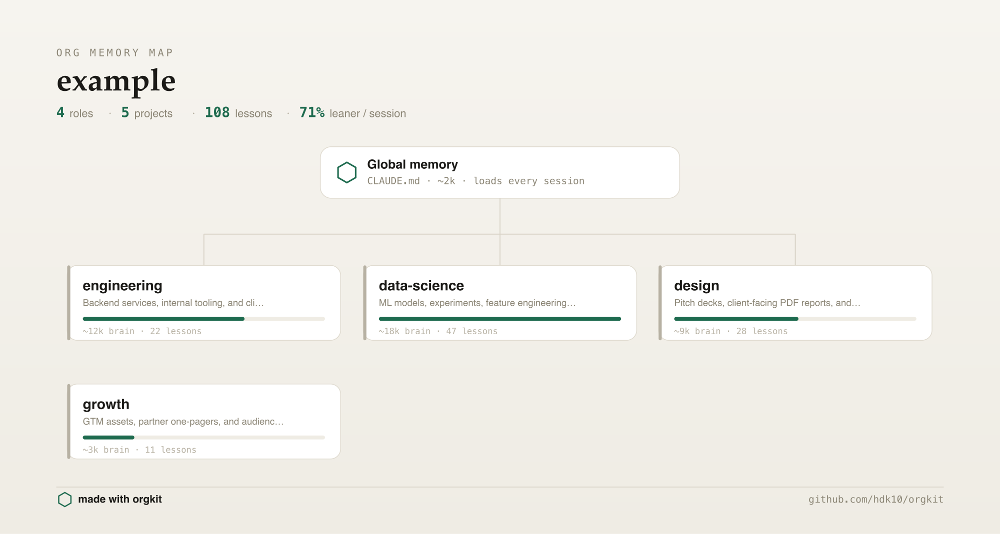
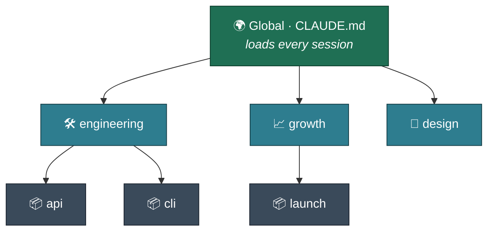
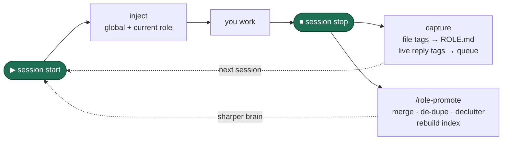

<div align="center">


[](https://www.python.org/)
[](#)
[](LICENSE)
[](https://claude.com/claude-code)
[](#contributing)

</div>

<p align="center"></p>

<p align="center"><sub>Your org as a shareable map. Run <code>/org-map</code> to generate your own.</sub></p>

---

## The problem

Every AI session starts the same way: re-explaining who you are, what you're building, and what you decided last time. That's the **context tax**.

The naive fix — one big memory file — backfires. It bloats, loads irrelevant context (design notes while you're writing code), and burns tokens. **orgkit fixes this by giving your work an org chart.** Memory loads at three levels, only the relevant parts load per session, and the system maintains itself.

---

## 3 levels of memory



| Level | File | Loads when |
|---|---|---|
| **Global** | `CLAUDE.md` | Every session |
| **Role** | `‹role›/memory/ROLE.md` | Only when you're in that role |
| **Project** | `‹role›/‹project›/memory/PROJECT.md` | When you open that project |

You load `global + 1 role` instead of everything. Savings scale with role count: ~33% with 2 roles, up to ~85% with 6+.

---

## Quickstart

You're in Claude Code already. Install it as a plugin from the `/plugin` menu:

1. Run **`/plugin`** → **Add marketplace** → `hdk10/orgkit`
2. **Install plugin** → `orgkit` → restart the session
3. In any repo, run **`/orgkit:orgkit-init`** — the model reads your folders, proposes an org, you approve, and it scaffolds everything. Hooks wire up; memory auto-loads next session.

> `/plugin` is a built-in command. Pick it from the menu (or the autocomplete dropdown) — pasting the full line routes it to the model instead of the plugin manager.

<details>
<summary><b>Prefer to clone and vendor it into the repo?</b></summary>

```bash
git clone https://github.com/hdk10/orgkit.git && cd orgkit
python3 setup.py --analyze   # read-only preview, changes nothing
python3 setup.py             # install
```

The clone path copies the commands un-namespaced, so they're `/orgkit-init`, `/org-status`, etc. (no `orgkit:` prefix).

</details>

---

## Commands

Nine slash commands, available inside any Claude Code session after install. Installed as a plugin they're prefixed `/orgkit:` (e.g. `/orgkit:org-status`); via the clone path they're bare (`/org-status`).

| Command | What it does |
|---|---|
| `/orgkit-init` | Model reads your repos, proposes an org with rationale, you approve — then scaffolds everything |
| `/orgkit-analyze` | Read-only preview: maps folders to roles, estimates token savings, changes nothing |
| `/orgkit-migrate` | Moves folders under roles, fixes path refs, model fixes imports regex can't, writes `MIGRATION.md` |
| `/orgkit-doctor` | Diagnoses dangling hooks, malformed `roles.json`, drift between config and filesystem |
| `/capture ‹role›` | Distills lessons from this session's diffs + conversation into the role's queue (runs on Sonnet) |
| `/role-promote ‹role›` | Reconciles a role brain: merge, de-dupe, declutter, rebuild index. No API key needed |
| `/orgkit-cadence` | Analyzes your real usage and recommends a cadence + time slots for optional scheduled batch capture |
| `/new-project` | Scaffolds a new project under the right role with its own `PROJECT.md` |
| `/org-status` | Shows roles, projects, and what's queued for reconcile |
| `/org-map` | Renders a shareable org-chart image of your setup |

---

## How it maintains itself



- **Start** → hook injects global + your current role (only the one you're in), plus a live-capture directive: as you work, just *say* a `[LESSON]/[GOTCHA]/[PATTERN]/[TOOL]` line in your reply when something durable surfaces (especially when the user corrects you).
- **Stop** → hook harvests those tagged lines from the session transcript into the role's queue (`_pending.md`), scrapes any inline tags written into changed *files* straight into `ROLE.md`, and queues a transcript pointer. The model never has to write a memory file — the hook does it deterministically.
- **`/role-promote`** → reconciles the brain (merge, de-dupe, declutter, rebuild index) from diffs **and the session conversation**. Shrink-guard + `.bak` protect it. Nudged when a role goes stale; not hands-free.
- **Scheduled batch capture (optional)** → `/orgkit-cadence` analyzes your usage and installs a cron that runs `/capture` for stale-but-pending roles on a cadence — on Sonnet, using your subscription token (never an API key), at most once per period. A safety net for anything live capture missed.

<details>
<summary><b>Migrating an existing messy repo</b></summary>

```bash
python3 setup.py --target ~/work --migrate
```

What happens:
1. **Dry-run first** — shows the full plan before anything moves.
2. Sorts folders under roles you define.
3. Auto-fixes literal path strings. Imports and relative paths regex can't safely touch are flagged — `/orgkit-migrate` opens each one with the model, fixes it, then re-scans.
4. Writes `MIGRATION.md` — a complete old path → new path map.
5. Seeds a `ROLE.md` per role and a root `CLAUDE.md`. Never deletes anything.

Full walkthrough: [docs/MIGRATION.md](docs/MIGRATION.md)

</details>

<details>
<summary><b>Safe by design — how to undo</b></summary>

| Concern | What orgkit does |
|---|---|
| **Touching your files** | Migration dry-runs first. Nothing is ever deleted — only moved and re-referenced. |
| **Touching `settings.json`** | Timestamped backup written before every change: `settings.json.bak-YYYYMMDD-HHMMSS`. |
| **Corrupting memory** | Reconcile writes `.bak` before every rewrite. Shrink-guard rejects passes that drop the file past a safe threshold. |
| **"Just want to look"** | `python3 setup.py --analyze` is always read-only. |
| **Undo hooks** | `python3 setup.py --uninstall` removes only orgkit's hooks; memory files untouched. Add `--deep` to also remove the engine. |
| **Reverse a migration** | `python3 setup.py --rollback` reads `MIGRATION.md` and reverses the moves. Or `git restore` if you committed before migrating. |
| **Something broken** | `python3 setup.py --doctor` diagnoses and repairs what it can. |

</details>

<details>
<summary><b>FAQ</b></summary>

**Do I need an API key or paid plan?**
No. `/role-promote` runs inside your Claude Code session using the session model.

**Does it work on Windows?**
Yes — Python 3, stdlib only. Use PowerShell. Scheduled batch capture (`/orgkit-cadence`) installs a Unix cron, so it's macOS/Linux-only; the start/stop hooks and live capture still keep memory fresh on Windows.

**Will it touch my files destructively?**
No. Migration dry-runs first, never deletes, keeps a `MIGRATION.md` map. Reconcile keeps a `.bak` and a shrink-guard. `settings.json` is backed up before every change.

**Where do the hooks live?**
In your user-global `~/.claude/settings.json` (project-level hooks have a known reliability issue in CC). A timestamped backup is written before registration.

**Can I add more roles later?**
Yes. Just run `/orgkit-init` again or add a role manually to `roles.json` and run `python3 setup.py --sync`.

**Can capture run headlessly on a schedule?**
Yes — `/orgkit-cadence` installs a cron that runs `/capture` headlessly via `claude -p` (slash commands *do* work in print mode). It runs on **Sonnet**, authenticates with your **subscription token** (`claude setup-token` → `CLAUDE_CODE_OAUTH_TOKEN`, never an API key, so no separate bill), and a once-per-cadence guard means it captures at most once per period no matter how many time slots are scheduled. Reconcile (`/role-promote`) stays interactive — it's nudged at session start when a role goes stale, since it rewrites the brain and benefits from your presence.

</details>

<details>
<summary><b>Why not just X?</b></summary>

Full reasoning: [docs/COMPARISON.md](docs/COMPARISON.md)

| | orgkit | One big `CLAUDE.md` | Cursor rules | mem0 / Letta | Built-in memory |
|---|---|---|---|---|---|
| Scoping | Per-role + per-project | One bucket | Per-repo only | Semantic search | Vendor-managed |
| Auto-selected context | Yes | No | No | Yes | No |
| Self-maintaining | Yes | No (manual) | No (manual) | Yes | Partial |
| Your files, git-versioned | Yes | Yes | Yes | No (vector DB) | No (vendor) |
| Needs API key / service | No | No | No | Yes | Yes |
| Works in Claude Code | Yes | Yes | No (Cursor only) | No | Partial |

Where alternatives win honestly: **mem0/Letta** is better for semantic search across a large heterogeneous corpus. **Cursor rules** are the right tool if all you want is per-repo coding conventions.

</details>

---

## Learn more

- [How it works](docs/HOW-IT-WORKS.md) — the mental model, token math, and how reconcile differs from append
- [Migration guide](docs/MIGRATION.md) — step by step, dry-run, and rollback
- [Anatomy of a role](docs/ANATOMY-OF-A-ROLE.md) — every section of `ROLE.md`, the tag convention, how `/role-promote` reconciles
- [Comparison](docs/COMPARISON.md) — orgkit vs. every alternative, honestly
- [`example/`](example/) — a full sample org to explore before touching your own

## Contributing

PRs welcome. Python 3, stdlib only — keep it dependency-free and portable.
See [CONTRIBUTING.md](CONTRIBUTING.md) for setup and conventions. See [ROADMAP.md](ROADMAP.md) for what's next.

## License

MIT. Use it, fork it, ship it. See [LICENSE](LICENSE).

---

<div align="center"><sub>Built for everyone who's tired of re-introducing themselves to their AI every morning.</sub></div>
