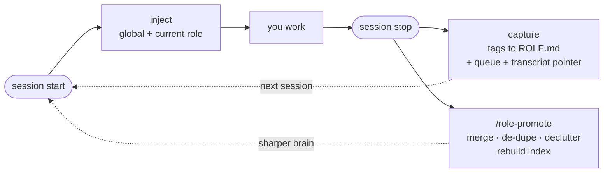

# How orgkit works

If you just want to install, the [README](../README.md) covers it. Read this when you want to understand why orgkit is shaped the way it is.

---

## The problem: one big file doesn't scale

The natural move is to write everything the AI should know into one file. It works until it doesn't. Deployment gotchas end up next to brand voice next to pricing. The model reads **all of it, every session**, whether you're fixing a bug or drafting an email.

Two costs compound:

- **Token cost** — every irrelevant line is read on every turn.
- **Attention cost** — a model given ten topics at once reasons less sharply about the one in front of it.

---

## The three levels

```
CLAUDE.md                    ← loads every session
‹role›/memory/ROLE.md        ← loads only in that role
‹role›/‹project›/memory/PROJECT.md  ← loads for that project
```

| Level | What goes here | When it loads |
|---|---|---|
| **Global** `CLAUDE.md` | Who you are, how you think, operating principles | Every session |
| **Role** `ROLE.md` | Gotchas, patterns, lessons for one function (eng / design / growth…) | Only when working in that role |
| **Project** `PROJECT.md` | Decisions, quirks, current state for one piece of work | Only for that project |

**Rule of thumb:** a fact lives at the highest level where it's still always true. A deployment gotcha that bites every backend project belongs in the engineering `ROLE.md`. A quirk specific to one service belongs in its `PROJECT.md`.

---

## The token math

Say you have one global brain (~1k tokens) and 6 roles (~2k each):

| Approach | Tokens per session |
|---|---|
| One big file | `1k + 6 × 2k = 13k` — every session, every role |
| orgkit | `1k + 1 × 2k = 3k` — just what you need |

That's ~77% smaller in this example. Savings grow as you add roles; with only 2 roles it's ~33%.

---

## The loop



**Capture is dumb and fast** — on Stop, `role_digest.py` regex-scrapes `[LESSON]/[PATTERN]/[GOTCHA]/[TOOL]` tags from changed files and appends bullets directly into the matching `ROLE.md` sections. No model, no API key; writes a "files touched" stub + transcript pointer to `_pending.md` for the next step.

**Reconcile is smart** — `/role-promote` runs through your session model (no separate API key). It reads `ROLE.md` + `_pending.md` + changed files + the session conversation, then merges, de-dupes, declutters, and rebuilds the project index. Triggered manually (`/role-promote ‹role›`) or by a `SessionStart` nudge when the role is detected as stale (>7 days with pending activity).

<details>
<summary>Optional cron / launchd job</summary>

The optional cron job does not reconcile headlessly — it can't, since `claude -p "/role-promote"` doesn't execute slash commands in print mode. What it does: scans for stale roles and writes a `.reconcile_due` marker. Your next interactive session consumes the marker and fires the nudge. The session nudge is the reliable path.

</details>

---

## Reconcile vs. append

Appending is what bloats the one big file. Reconciling is what makes orgkit compound.

| | Append (the trap) | Reconcile (orgkit) |
|---|---|---|
| Duplicates | Pile up | Collapsed into one |
| Related notes | Scattered | Merged into existing section |
| Stale notes | Linger forever | Pruned when superseded |
| Size over time | Grows monotonically | Stays sharp; can shrink |
| Safety | — | 60%-shrink-guard + `.bak` |

Before any reconcile, orgkit writes a `.bak` of the current `ROLE.md`. If the reconcile would drop the file below 60% of its previous size, it's rejected — the `.bak` is right there to restore from.

---

## Summary

- **Scoping** — each session loads `global + one role`, nothing more.
- **Capture** — tags you drop inline are harvested automatically on stop.
- **Reconcile** — memory gets sharper with use, not heavier.

→ Next: [Anatomy of a Role](ANATOMY-OF-A-ROLE.md) · [Migration guide](MIGRATION.md)
