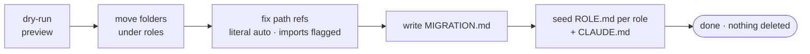

# Migrating an existing repo

orgkit can sort your existing folders under roles, fix path references, and leave you a map. **It never deletes anything.**

## Run it

```bash
python3 setup.py --target ~/work --migrate
# or from inside Claude Code:
# /orgkit-migrate
```

Add `--dry-run` to preview without writing. Add `--rollback` to reverse a migration using `MIGRATION.md`.

---

## What happens, in order



- **Dry-run** — prints every `old path → new path`; nothing moves until you confirm.
- **Move** — reversible via `--rollback` or `git`.
- **Fix refs** — literal path strings are rewritten automatically; imports and relative paths that regex can't safely rewrite are **flagged** for interactive fix via `/orgkit-migrate`.
- **Seed memory** — `ROLE.md` + `CLAUDE.md` are created idempotently (won't overwrite existing files); `.last_promote` is stamped so you don't get a reconcile nag on day one. `PROJECT.md` per project comes later via `/new-project`.

**Sample dry-run output:**

```
DRY RUN — no changes written yet
  api-thing/     →  engineering/api-thing/
  landing-page/  →  growth/landing-page/
  pitch-deck/    →  design/pitch-deck/
Proceed? [y/N]
```

---

## Rollback

Two options — both safe, neither deletes:

1. **`--rollback`** — reverses moves and ref rewrites using `MIGRATION.md`.
2. **Git** — `git restore .` / `git checkout` if you committed before migrating.

> Tip: commit or back up before migrating. Not required, but one-command undo is nice.

---

## After migration

Your repo has role folders, a `ROLE.md` per role, a global `CLAUDE.md`, and the hooks wired. Open Claude Code and role memory loads automatically. Add project brains as you go with `/new-project`.

→ [README](../README.md) · [How it works](HOW-IT-WORKS.md)
